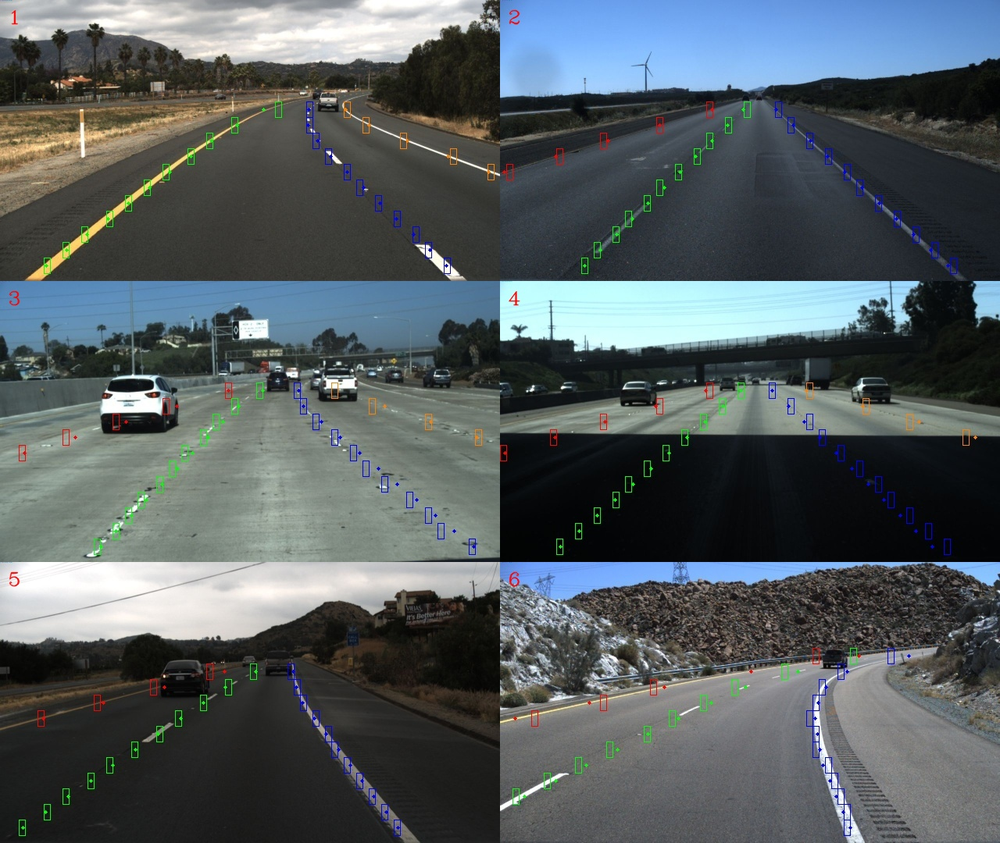

# Lane Detection

*<u>v2.0.0 新变化：构建了新的基于图像分割的车道线检测模型。</u>*

## 项目简介

本项目设计了一种网格级图像分割的车道线检测方法，结合基于图像分割的方法（如 [LaneNet](https://arxiv.org/abs/1802.05591)）和基于关键点网格的方法（如 [Ultra Fast Lane Detection](https://arxiv.org/abs/2004.11757)）的特点，对图像进行网格划分，预测每个网格中存在车道线的概率，保证可用性同时一定程度上减少计算量。

### 模型结构

具体来说，本项目以宽高均为 8 像素的网格对输入图像进行划分。模型结构为 U-Net 的变体，采用预训练的 ResNet 作为特征编码器，使用反卷积进行上采样操作，且每层的上采样结果图与对应尺寸的编码器输出特征图进行拼接融合，直到特征图的空间分辨率等于网格尺寸。

值得一提的是，为了进一步减少计算量，考虑到车道线不应该出现在图像的上部且图像上部的信息对车道线检测基本无用，本项目仅将图像的下部区域输入模型。

### 训练策略

与大多数图像分割模型相同，本项目采用二元交叉熵和 Dice 损失函数训练模型。

模型采用 [TuSimple](https://www.kaggle.com/datasets/manideep1108/tusimple) 数据集进行训练，对原始的标签进行了处理，使之符合模型训练数据的要求（具体要求见下文），其中训练集 3626 张图像，测试集 2782 张图像，验证集 200 张图像。验证集图像从测试集中随机抽取得到，旨在判断模型的收敛性以及可能的过拟合。

## 效果展示

以下是测试集中部分图像模型预测结果的可视化展示，其中点标注为预测结果中车道线所在网格的中心点。



## 性能评估

### 检测精度指标

本项目采用 F1-score 和分割车道线区域交并比 (IoU) 作为模型的检测精度指标，同时还采用 ROC 曲线下面积 (AUC) 和 P-R 曲线下面积 (AP) 从总体上评估模型性能，下面给出当前在 [TuSimple](https://www.kaggle.com/datasets/manideep1108/tusimple) 数据集下训练得到的最优模型检测精度指标。

| F1-Score @ 0.5 (%) | IoU @ 0.5 (%) | AUC (%) | AP (%) |
|:------------------:|:-------------:|:-------:|:------:|
| 79.18              | 65.53         | 98.96   | 86.91  |

## 使用说明

### 环境搭建

首先需要安装本项目依赖的各种库和工具包。

```shell-session
pip install -r requirements.txt
```

### 数据集准备

本项目的训练数据集格式如下，分为训练集、验证集和测试集，所有的图像文件放入 images 目录下，分割掩码图像文件为保证数值的准确性请使用 png 格式并放入 labels 目录下。

```shell-session
datasets/
├── test/
│   ├── images/
│   │   ├── xxx.jpg
│   │   ├── xxx.jpg
│   │   └── ...
│   ├── labels/
│   │   ├── xxx.png
│   │   ├── xxx.png
│   │   └── ...
│   └── annotations.json
├── train/
│   ├── images/
│   │   ├── xxx.jpg
│   │   ├── xxx.jpg
│   │   └── ...
│   ├── labels/
│   │   ├── xxx.png
│   │   ├── xxx.png
│   │   └── ...
│   └── annotations.json
└── valid/
    ├── images/
    │   ├── xxx.jpg
    │   ├── xxx.jpg
    │   └── ...
    ├── labels/
    │   ├── xxx.png
    │   ├── xxx.png
    │   └── ...
    └── annotations.json
```

其中 annotations.json 为所在数据集划分的索引文件。annotations.json 文件中的每一行 JSON 格式数据为一个样本标签对的信息，各字段及其描述如下。

| 字段名   | 字段描述                            |
|:-----:|:-------------------------------:|
| image | 输入图像的文件名，对应 images 目录下的图像文件名。   |
| label | 分割掩码图像的文件名，对应 labels 目录下的图像文件名。 |

### 模型训练

准备好数据集后，运行 train.py 开始训练，默认的训练及评估配置文件是 configs/config.toml，其中各个字段及其描述如下。

| 字段名                  | 字段描述                                                                                    |
|:--------------------:|:---------------------------------------------------------------------------------------:|
| num-epochs           | 训练迭代次数。                                                                                 |
| num-workers          | 训练及评估数据加载进程数。                                                                           |
| batch-size           | 训练及评估批大小。                                                                               |
| learning-rate        | 模型训练学习率。                                                                                |
| weight-decay         | 模型训练权重衰减。                                                                               |
| log-interval         | 日志输出频率。                                                                                 |
| load-pretrained      | 是否使用预训练参数初始化模型权重。                                                                       |
| load-checkpoint      | 是否加载 checkpoint 继续训练，若为 true 则从 load-path 加载模型权重，覆盖 load-pretrained 值，反之则使用初始化模型权重开始训练。 |
| load-checkpoint-path | 训练初始模型的加载路径，同时也为待评估模型加载路径。                                                              |
| best-checkpoint-path | 训练中当前验证集最优模型保存路径。                                                                       |
| last-checkpoint-path | 训练中最后一次训练模型保存路径。                                                                        |

也可以基于我训练的模型进行进一步调优，模型权重文件在本项目 Releases 中公布。

### 模型评估

模型训练完成后，运行 eval.py 进行评估。这将会分别计算模型在测试集上的各种检测精度指标。默认的配置文件及字段含义同上。
