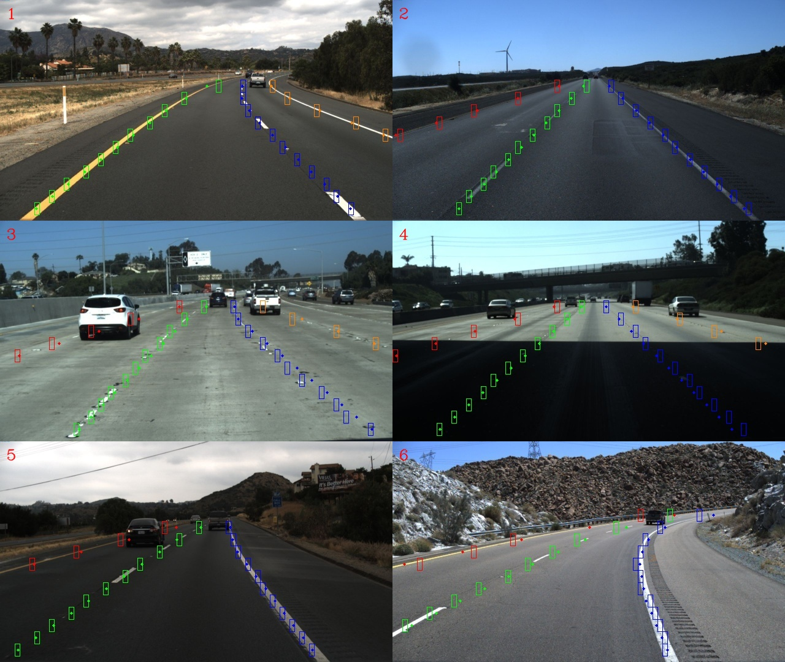

# Lane Detection

**一个简单高效的车道线检测模型。**

## 项目简介

本项目构建了一个简单高效车道线检测模型，尽量以可以接受的精度损失为代价换取更高的计算效率。

### 模型结构

本项目的模型设计参考了[这篇论文](https://arxiv.org/abs/2004.11757)。对图像中车道线可能存在的区域（图像的下部）进行网格划分，将车道线检测问题转化为每行车道线所在网格的分类问题。将图像中车道线所在区域划分为 12 行，每行划分为 80 个网格，模型需要学习如何根据输入图像正确地对每行中车道线的位置进行分类，找出最有可能存在该车道线的网格，模型共能检测图像中左侧两条和右侧两条车道线。

#### 设计要点

- **Backbone：** 主干网络采用与 YOLO 系列 CSPDarknet 类似的网络结构作为特征提取器，这种结构在尽量保证精度的同时减少模型的参数和计算量。输入图像的宽高固定为 640 x 360，在 (B, 3, 360, 640) 格式的图像数据输入时，输出的特征图格式为 (B, 256, 12, 20) 。

- **Neck：** 颈部模块负责对主干网络提取的特征图作进一步的降维处理，利用点卷积将特征图通道数由 256 降为 4 以减少数据的特征维数，最后展平生成整个图像的 960 维特征向量表示。

- **Head：** 检测头模块负责根据图像的特征向量生成最终的检测结果，首先通过一个全连接层对特征进行选取，调整形状后通过点卷积进行拓展，得到每条车道线在每一行所在网格的独热输出。利用点卷积代替部分的全连接可以有效地减少模型的参数量，限制模型的复杂度。最终结果的格式为 (B, 4, 12, 81) ，从左向右分别为批大小，车道线条数（分别代表从左到右的左侧两条和右侧两条车道线），划分行数，网格分类数（最后一维代表此行没有车道线）。

### 训练策略

作为一种基于分类思想的模型，将模型的输出结果和标签分别从第 0 维到第 2 维展平后，可以视为一批图像数据中所有划分行的车道线所在网格多分类问题，计算交叉熵损失。

模型采用 [TuSimple](https://www.kaggle.com/datasets/manideep1108/tusimple) 数据集进行训练，对原始的标签进行了处理，使之符合模型训练数据的要求（具体要求见下文），剔除了一些标注有瑕疵的样本，并对整个数据集进行了随机洗牌重新划分，最终得到训练集 4343 张图像，测试集 1800 张图像，验证集 500 张图像。验证集图像从测试集中随机抽取得到，旨在判断模型的收敛性以及可能的过拟合。

训练过程采用多阶段训练，首先从一个较大的学习率开始快速学习主要的特征，此后每一个训练阶段适当调小学习率以进行更细致的调优。

### 效果展示

以下是测试集中部分图像模型预测结果的可视化展示，其中点标注为原始的车道线点坐标标签，方框标注为模型预测结果网格，红色、绿色、蓝色和黄色标注分别代表车辆左方第二条、左方第一条、右方第一条和右方第二条车道线检测结果。



### 性能评估

以效果展示图 5 中红色标注的车道线检测结果为例，可以看到虽然模型的预测结果没有和标签完全一致，但从总体上依然可以认为模型做出了正确的预测。考虑这类情况，参考多分类问题中的 TopK Acc 评价指标，结合车道线检测问题的特点，本项目采用 DeltaX Acc 作为模型的检测精度评价指标，表示预测网格与真实标签网格之间距离小于等于 X 个单位的样本数与全部样本数的比值。

#### 检测精度指标

下面给出当前训练得到的最优模型检测精度指标：

| Delta0 Acc | Delta1 Acc | Delta2 Acc |
|:----------:|:----------:|:----------:|
| 0.745      | 0.942      | 0.964      |

#### 计算性能指标

在模型的训练和性能测试中，本机环境 CPU 为 Intel Core i5-1155G7 @ 2.50Ghz，服务器环境 GPU 为 NVIDIA Tesla P4，推理帧率均在 PyTorch 框架环境下进行测试，下面给出当前训练得到的最优模型的一些计算性能指标：

| Params（M） | FLOPs（G） | 本机 CPU 推理帧率（FPS） | 服务器 GPU 推理帧率（FPS) |
|:---------:|:--------:|:----------------:|:-----------------:|
| 1.75      | 0.78     | 45.54            | 168.82            |

## 使用说明

### 环境搭建

首先需要安装本项目依赖的各种库和工具包。

```bash
pip install -r requirements.txt
```

### 数据集准备

本项目的训练数据集格式如下，分为训练集、验证集和测试集，所有的图像文件需要调整尺寸至 640 x 360 并放入相应的 images/ 目录下。

```bash
datasets/
├── test/
│   ├── images/
│   │   ├── xxx.jpg
│   │   ├── xxx.jpg
│   │   └── ...
│   └── annotations.json
├── train/
│   ├── images/
│   │   ├── xxx.jpg
│   │   ├── xxx.jpg
│   │   └── ...
│   └── annotations.json
└── valid/
    ├── images/
    │   ├── xxx.jpg
    │   ├── xxx.jpg
    │   └── ...
    └── annotations.json
```

其中 annotations.json 为所在数据集划分中的车道线位置标注文件，其格式及说明如下。

```json5
{
    /*
     * 键的名称对应 images/ 目录下的所有图像文件名。
     */
    "1.jpg": {
        /*
         * 键 samples 为车道线点 x 轴坐标标记，固定为一个 4x12 的二维数组。
         * 第一维表示模型共能检测 4 条车道线。
         * 按顺序分别为以车辆为中心的左方第二条、左方第一条、右方第一条和右方第二条车道线。
         * 例如效果展示图 3 中从左到右的红色，绿色，蓝色和黄色车道线。
         * 第二维表示自上而下按照 anchors 中 y 轴坐标采样下的车道线 x 轴坐标值。
         * 若该位置车道线不存在则标记为 -1。
         */
        "samples": [
            [...],
            [...],
            [...],
            [...]
        ],
        /*
         * 键 anchors 为车道线区域 y 轴采样坐标序列，固定为一个长度为 12 的数组。
         * 这个键在标注文件中不是必须的，但要保证整个数据集中所有图像的 y 轴采样坐标序列一致。
         */
        "anchors": [...]
    },
    ...
}
```

### 模型训练

准备好数据集后，运行 train.py 开始训练，默认的训练配置文件是 <u>configs/train.yaml</u>，默认配置及其含义如下：

```yaml
device: "cuda"        # 设备名称，与 PyTroch 的设备名称保持一致
epochs: 200           # 训练迭代次数
num-workers: 8        # DataLoader 加载子进程数
batch-size: 32        # 批大小

learning-rate: 0.0005        # 学习率
weight-decay: 0.0001         # 权重衰减

use-amp: true                # 是否启动 AMP（自动混合精度），开启有助于减少显存占用并加速训练
use-augment: true            # 是否启用图像数据增强
dropout: 0.5                 # 模型全连接层的随机丢弃概率
load-checkpoint: false       # 是否加载 checkpoint 继续训练，若为 true 则从 load-path 加载模型权重，反之则使用初始化模型权重开始训练

load-path: "checkpoints/last-ckpt1.pt"    # 初始模型加载路径
best-path: "checkpoints/best-ckpt1.pt"    # 当前验证集最优模型保存路径
last-path: "checkpoints/last-ckpt1.pt"    # 最后一次训练模型保存路径
```

也可以基于我训练的模型进行进一步调优，模型权重文件在本项目 Releases 中公布。

### 模型评估

模型训练完成后，运行 eval.py 进行评估。这将会分别计算模型在测试集上的 Delta0 Acc，Delta1 Acc 和 Delta2 Acc 检测精度指标。默认的配置文件为 <u>configs/eval.yaml</u>，默认配置及其含义如下：

```yaml
device: "cuda"                                # 设备名称，与 PyTroch 的设备名称保持一致
model-path: "checkpoints/best-ckpt3.pt"       # 待评估模型加载路径
batch-size: 32                                # 批大小
num-workers: 8                                # DataLoader 加载子进程数
```

## 后续计划

- 观察效果展示中图 6 以及其他的模型预测结果图可以看出，模型在预测曲率较大的车道线和距离较远处的车道线上表现得不够理想。V2 版本的模型正在实验中，旨在解决或缓解上述问题，期望能够达到预期的效果。

- 基于 ONNX Runtime 的模型 C++ 推理部署程序正在开发中。


